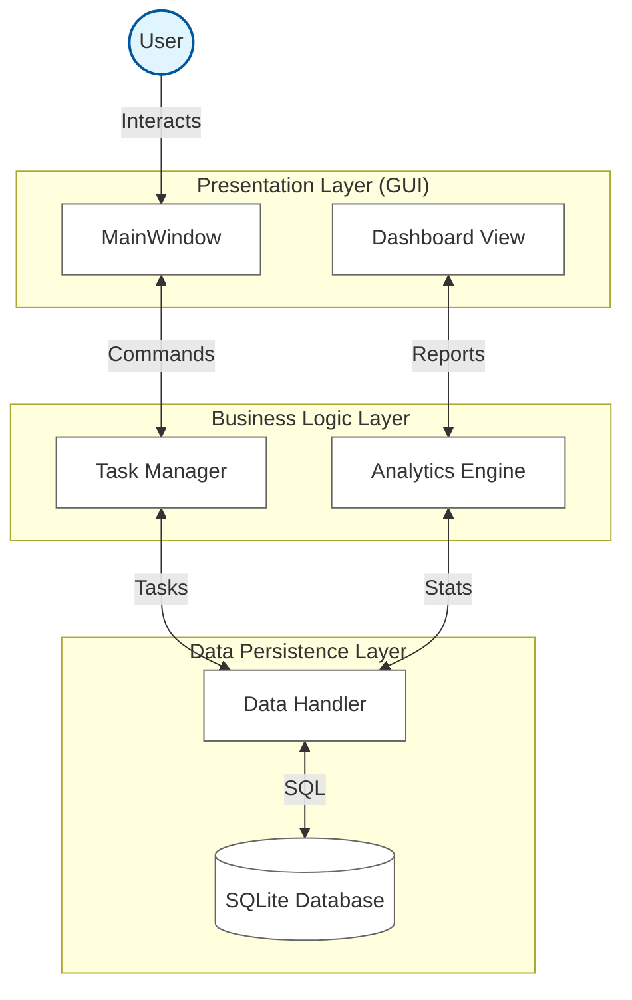

# SE-Chimkens-Efficio

**PROJECT DESCRIPTION**

EFFICIO is a task and performance tracker system designed to help individuals organize daily activities, meet deadlines, and improve productivity. By combining task management with performance analytics, EFFICIO provides users with clear insights into their progress, time usage, and overall efficiency—going beyond traditional to-do lists and basic note applications.

## Technical Architecture

### 1. Architectural Style
**Layered Architecture (Presentation, Business Logic, Data Access)**
The system follows a strict separation of concerns, ensuring that the User Interface is decoupled from the underlying logic and data storage.

### 2. High-Level Architecture Diagram
This diagram shows the major components and how data flows between them.

### 3. Design Principles Applied

*   **Separation of Concerns (SoC):**
    The application is divided into distinct layers. The **UI** only handles user interaction and display. The **Business Logic (TaskManager)** handles rules and validation. The **Data Layer** handles storage. This makes the code easier to maintain and test.

*   **Single Responsibility Principle (SRP):**
    Each class has a focused purpose. For example, the `Analytics` class is solely responsible for calculating statistics and does not manage task creation or database connections.

## System Design (UML)

### 1. Use Case Diagram
**Scope:** Single-user, local application.
 

 

### 2. Class Diagram
**Tech Stack:** Python (Backend) + PyQt (Frontend).
 

 

### 3. Sequence Diagram (Add Task)
**Flow:** UI -> Controller -> Database.
 

 